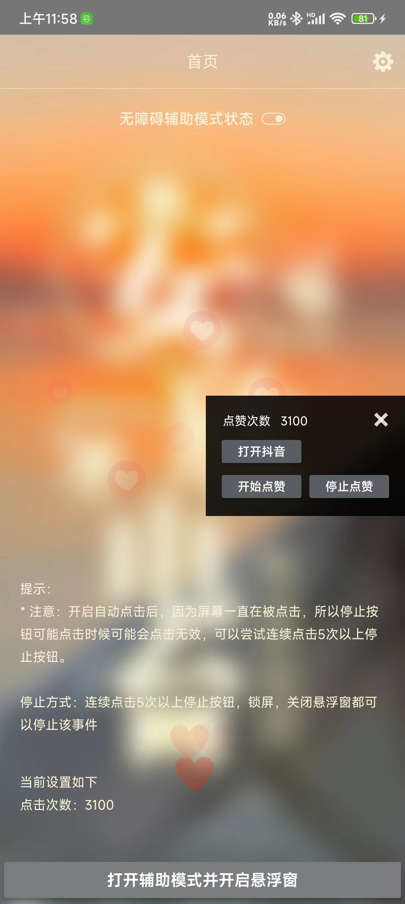
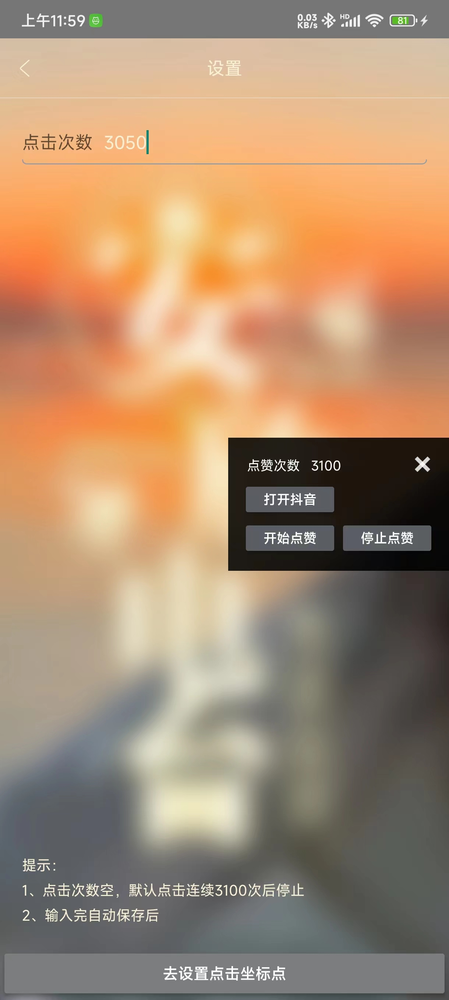
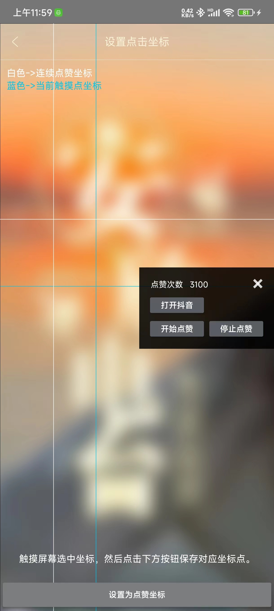

# -------------------------中文-------------------------
# androidAutoClick 该项目为打开抖音自动去往直播间点赞（3000+）
## 使用：
* 1、先打开app辅助模式：然后点击跳转到抖音
* 2、打开抖音后，点击开始点赞，连续点赞3000+
* 3、注意因为软件一直连续点击屏幕，所以取消停止点赞按钮可能点击不生效，所以可以连续点击停止按钮五次以上，或者锁屏都会停止点赞。

## 默认点赞跳转脚本具体逻辑在该类：[AnXinLiveRoomAutomaticLikesScript.kt](app/src/main/java/com/example/androidautoclick/ui/script/AnXinLiveRoomAutomaticLikesScript.kt)

### 需要自己打开什么软件【抖Y,快S】？做什么事情，参考该类自己改。

## Demo APK下载

[github下载链接](https://github.com/notwalnu/androidautoclick/blob/main/demo/app-debug.apk)

[国内 apk下载链接](https://fir.xcxwo.com/zxvlew)

## 参考：如果不会使用请查看使用视频-> [点击查看视频](https://foreo-app.oss-cn-beijing.aliyuncs.com/testclick_demo.mp4)

## 屏幕截图

  

这是一个非常简单的小小小项目，开源给大家学习和玩耍。
  

# -------------------------English-------------------------

# AndroidAutoClick This project automatically likes the live broadcast room for opening Tiktok (3000+)

## Usage:

* 1、First open the app auxiliary mode: then click to jump to Tiktok

* 2、After turning on Tiktok, click Start Like to like 3000 consecutive times+

* 3、Note that because the software keeps continuously clicking on the screen, the cancel stop like button may not take effect. Therefore, you can click the stop button more than five times in a row, or lock the screen to stop liking.

## The specific logic of the default like jump script is in this class: [AnXinLiveRoomAutomaticLikesScript. kt]（app\src\main\java\com\example\androidautoclick\ui\script\AnXinLiveRoomAutomaticLikesScript.kt）

### What software do you need to open on your own? What to do, refer to the category and make your own changes.

## Demo APK Download

[Github download link](https://github.com/notwalnu/androidautoclick/blob/main/demo/app-debug.apk)

[Domestic APK download link](https://fir.xcxwo.com/zxvlew)

## Reference: If you don't know how to use it, please refer to the usage video -> [Click to view video](https://foreo-app.oss-cn-beijing.aliyuncs.com/testclick_demo.mp4)

## ScreenShot

  

This is a very simple small project, open source for everyone to learn and play with.
